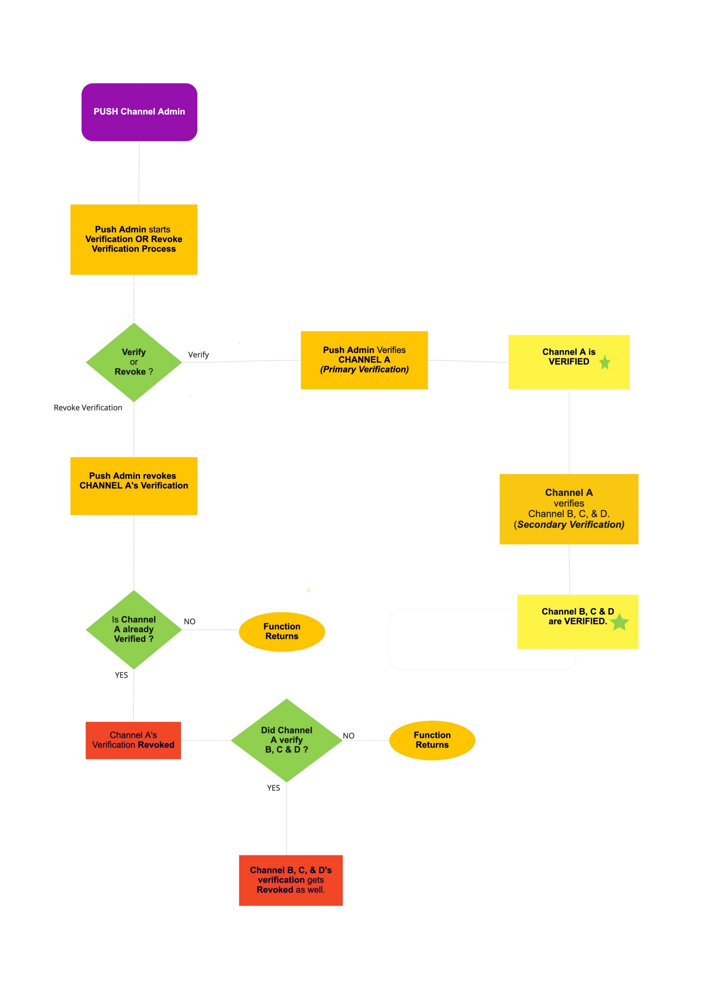

# EPNS(Ethereum Push Notification Service) Code Review

### Introduction

Ethereum Push Notification Service (EPNS), now known as the Push Protocol, is a communication protocol designed for the web3 ecosystem. It enables cross-chain notifications and messaging for decentralized applications (dApps), wallets, and services tied to wallet addresses in an open, gasless, and platform-agnostic fashion.

The protocol was created to address the lack of a notification mechanism in web3, which often results in users missing important updates, events, actions, and more. EPNS aims to solve this issue by providing a push notification service that can notify users or wallet addresses of important updates.

### Application Workflow


- **Integration:** To integrate EPNS into your application, you need to utilize the Push SDK. This SDK offers an abstraction layer for incorporating Push protocol features into both your frontend and backend systems

- **Subscription:** Users can subscribe to EPNS channels from a frontend application. This allows them to receive notifications from the channels they choose

- **Notification Creation:** Any dApp, service, or smart contract can send notifications to users (wallet addresses) in a platform-agnostic way. The notifications are triggered when a smart contract reaches certain conditions

- **Notification Delivery:** The notifications are delivered to the user's device via the platform they are using (mobile, tablet, web, etc.). The user has full control over what notifications they receive, allowing them to subscribe to or unsubscribe from the channels that they deem fit

- **User Interaction:** The user can interact with the notification, for example, by clicking on it to open the dApp, wallet, or smart contract that sent the notification

- **Governance:** The protocol governance is intended to incentivize continued adoption of the EPNS protocol, which is achieved by providing incentives for all users involved. These incentives are given in the form of PUSH tokens

### Code Walkthrough

The EPNS protocol consists of two distinct smart contracts, namely the "EPNS Core" and the "EPNS Communicator".

EPNSCore is the core protocol contract. It handles the creation of channels, channel state cycles, and channel verification features. Channels are created by dApps or smart contracts and require a minimum fee of 50 DAI. This fee forms a fund pool that generates constant interest (AAVE aDai). The generated interest from this goes to their subscribers as per their fair share.

EPNSCommunicator is the communicator protocol contract. It is responsible for sending notifications with EPNS CommV1. Any dApp, service, or smart contract can send notifications to users (wallet addresses) in a platform-agnostic way. The notifications are triggered when a smart contract reaches certain conditions

Here is the workflow for how these contracts work together:

- A dApp or smart contract creates a channel using the EPNSCore contract. This channel is tied to a specific wallet address and can send notifications to that address.

- The dApp or smart contract sends a notification using the EPNS Communicator contract. This notification is tied to the channel created.

- The notification is delivered to the user's device via the platform they are using (mobile, tablet, web, etc.). The user has full control over what notifications they receive, allowing them to subscribe to or unsubscribe from the channels that they deem fit.

#### EPNS_CORE_V1 Contract

This contract imports several interfaces to interact with AAVE Protocol and Uniswap and it also imports some of OpenZeppelin’s reusable libraries and contracts to build a secure smart contract.

#### A. IMPORTS

```
import "./interfaces/IPUSH.sol";
import "./interfaces/IADai.sol";
import "./interfaces/ILendingPool.sol";
import "./interfaces/IUniswapV2Router.sol";
import "./interfaces/IEPNSCommV1.sol";
import "./interfaces/ILendingPoolAddressesProvider.sol";

import "@openzeppelin/contracts/utils/Strings.sol";
import "@openzeppelin/contracts/math/SafeMath.sol";
import "@openzeppelin/contracts/token/ERC20/IERC20.sol";
import "@openzeppelin/contracts/proxy/Initializable.sol";
import "@openzeppelin/contracts/token/ERC20/SafeERC20.sol";
```

The interfaces imported are:

- **IPUSH:** This contract is used to interact with the PUSH token contract. The PUSH token is a utility token used by the Ethereum Push Notification Service (EPNS) to reward users for interacting with the platform.

- **IADai:** This contract interacts with Aave's lending pool. The redeem function is used to redeem or withdraw a certain amount of aDAI tokens from the Aave lending pool.

- **ILendingPool:** The epnscorev1 contract uses the ILendingPool interface to interact with the Aave lending protocol in order to manage the liquidity of PUSH tokens and generate revenue for the EPNS platform.
  IUniswapV2Router: The swapExactTokensForTokens function of the IUniswapV2Router interface is used in the epnscorev1 contract to swap PUSH tokens for other tokens.

- **IEPNSCommV1:** The EPNSCorev1 contract uses the subscribeViaCore function to subscribe users to channels on behalf of the EPNS platform. This allows the EPNS platform to send notifications to users about important events, such as new updates to the platform or new messages from channels that they are subscribed to.

- **ILendingPoolAddressesProvider:** The ILendingPoolAddressesProvider interface is used in the epnscorev1 contract to get the addresses of the Aave lending pool core and lending pool contracts. The epnscorev1 contract uses these addresses to interact with the Aave lending protocol.

The Openzeppelin imports are:

- **Strings.sol:** This library provides a number of functions for working with strings, such as converting strings to and from numbers, converting strings to uppercase and lowercase, and concatenating strings.

- **SafeMath.sol:** This library provides a number of functions for performing arithmetic operations safely, such as addition, subtraction, multiplication, and division.

- **IERC20.sol:** This interface defines the standard interface for an ERC20 token.

- **Initializable.sol:** This base contract is used to create upgradeable smart contracts.

- **SafeERC20.sol:** This library provides a number of wrapper functions for interacting with ERC20 tokens that check for success and revert on error. This can help to prevent unexpected behavior and security vulnerabilities in your Solidity contracts.

#### B. ENUMS

```
// For Message Type
enum ChannelType {
    ProtocolNonInterest,
    ProtocolPromotion,
    InterestBearingOpen,
    InterestBearingMutual
}
enum ChannelAction {
    ChannelRemoved,
    ChannelAdded,
    ChannelUpdated
}
```

**ChannelType:** This enum is used in this contract to determine the type of channel that is being created or interacted with. The type of channel determines a number of factors, such as the following: ProtocolNonInterest, ProtocolPromotion, InterestBearingOpen, InterestBearingMutual

**ChannelAction:** enum is used in the epnscorev1 contract to represent the different actions that can be performed on a channel. These actions are: ChannelRemoved, ChannelAdded, ChannelUpdated

#### C. STRUCTS

```
struct Channel {
    ChannelType channelType;

    uint8 channelState;

    address verifiedBy;

    uint256 poolContribution;

    uint256 channelHistoricalZ;

    uint256 channelFairShareCount;

    uint256 channelLastUpdate;

    uint256 channelStartBlock;

    uint256 channelUpdateBlock;

    uint256 channelWeight;
}
```

**channelType:** This is an enum that denotes the type of channel being created.

**channelState:** This is an unsigned integer that denotes the current state of a particular channel. The channel can have any of the following states: INACTIVE, ACTIVE, DEACTIVATED, BLOCKED.

**verifiedBy:** This is the address of the user who verified the channel. This is the user who is responsible for ensuring that the channel is legitimate and that the content that is sent through the channel is accurate and up-to-date.

**poolContribution:** This is the amount of PUSH tokens that the channel has contributed to the EPNS pool. This amount is used to calculate the channel's fair share of the rewards that are distributed from the pool.

**channelHistoricalZ:** The channel's historical Z-score. This is a measure of the channel's engagement and popularity.
channelFairShareCount: The number of fair shares that the channel has earned. This number is used to calculate the channel's share of the rewards that are distributed from the pool.

**channelLastUpdate:** The block number at which the channel was last updated.

**channelStartBlock:** The block number at which the channel was created.

**channelUpdateBlock:** The block number at which the channel was last updated.

**channelWeight:** The channel's weight. This is a measure of the channel's importance and influence.

#### D. MAPPING

```
mapping(address => Channel) public channels;
mapping(uint256 => address) public channelById;
mapping(address => string) public channelNotifSettings;
```

**channels:** This mapping is used to store all of the channels in the EPNS platform. The key of the mapping is the address of the channel, and the value of the mapping is the Channel struct that represents the channel.

**channelById:** This mapping is used to store the address of the channel for a given channel ID. The key of the mapping is the channel ID, and the value of the mapping is the address of the channel.

**channelNotifSettings:** This mapping is used to store the notification settings for a given channel. The key of the mapping is the address of the channel, and the value of the mapping is a string that represents the channel's notification settings.

```
string public constant name = "EPNS CORE V1";
bool oneTimeCheck;
bool public isMigrationComplete;

address public pushChannelAdmin;
address public governance;
address public daiAddress;
address public aDaiAddress;
address public WETH_ADDRESS;
address public epnsCommunicator;
address public UNISWAP_V2_ROUTER;
address public PUSH_TOKEN_ADDRESS;
address public lendingPoolProviderAddress;

uint256 public REFERRAL_CODE;
uint256 ADJUST_FOR_FLOAT;
uint256 public channelsCount;

//  @notice Helper Variables for FSRatio Calculation | GROUPS = CHANNELS
uint256 public groupNormalizedWeight;
uint256 public groupHistoricalZ;
uint256 public groupLastUpdate;
uint256 public groupFairShareCount;

// @notice Necessary variables for Keeping track of Funds and Fees
uint256 public POOL_FUNDS;
uint256 public PROTOCOL_POOL_FEES;
uint256 public ADD_CHANNEL_MIN_FEES;
uint256 public CHANNEL_DEACTIVATION_FEES;
uint256 public ADD_CHANNEL_MIN_POOL_CONTRIBUTION;
```

**name:** The name of the contract.

**oneTimeCheck:** A boolean variable that is used to ensure that certain functions are only called once.

**isMigrationComplete:** A boolean variable that indicates whether or not the migration process has been completed.

**pushChannelAdmin:** The address of the Push channel admin. This is the address of the account that is responsible for managing the Push channel.

**governance:** The address of the governance contract. This is the contract that is responsible for managing the EPNS platform.

**daiAddress:** The address of the DAI token contract.

**aDaiAddress:** The address of the aDAI token contract.

**WETH_ADDRESS:** The address of the WETH token contract.

**epnsCommunicator:** The address of the EPNS communicator contract. This is the contract that is responsible for sending notifications to users.

**UNISWAP_V2_ROUTER:** The address of the Uniswap V2 router contract. This is the contract that is used to swap tokens on the Uniswap V2 decentralized exchange.

**PUSH_TOKEN_ADDRESS:** The address of the PUSH token contract.

**lendingPoolProviderAddress:** The address of the Aave lending pool provider contract.

**REFERRAL_CODE:** The referral code for the EPNS platform.

**ADJUST_FOR_FLOAT:** A value that is used to adjust for floating-point errors.

**channelsCount:** The number of channels in the EPNS platform.

**groupNormalizedWeight:** The normalized weight of the group.

**groupHistoricalZ:** The historical Z-score of the group.

**groupLastUpdate:** The block number at which the group was last updated.

**groupFairShareCount:** The number of fair shares that the group has earned.

**POOL_FUNDS:** The amount of funds in the EPNS pool.

**PROTOCOL_POOL_FEES:** The amount of protocol fees that have been collected from the EPNS pool.

**ADD_CHANNEL_MIN_FEES:** The minimum amount of fees that must be paid to add a new channel to the EPNS platform.

**CHANNEL_DEACTIVATION_FEES:** The amount of fees that must be paid to deactivate a channel in the EPNS platform.

**ADD_CHANNEL_MIN_POOL_CONTRIBUTION:** The minimum amount of PUSH tokens that must be contributed to the EPNS pool to add a new channel.

#### E. EVENTS

```
event UpdateChannel(address indexed channel, bytes identity);
event ChannelVerified(address indexed channel, address indexed verifier);
event ChannelVerificationRevoked(address indexed channel, address indexed revoker);

event DeactivateChannel(
    address indexed channel,
    uint256 indexed amountRefunded
);
event ReactivateChannel(
    address indexed channel,
    uint256 indexed amountDeposited
);
event ChannelBlocked(
    address indexed channel
);
event AddChannel(
    address indexed channel,
    ChannelType indexed channelType,
    bytes identity
);
event ChannelNotifcationSettingsAdded(
    address _channel,
    uint256 totalNotifOptions,
    string _notifSettings,
    string _notifDescription
);
```

**UpdateChannel event:** This event is emitted when a channel's identity is updated. This event includes the address of the channel and the new identity of the channel.

**ChannelVerified event:** This event is emitted when a channel is verified by another user. This event includes the address of the channel and the address of the user who verified the channel.

**ChannelVerificationRevoked event:** This event is emitted when a channel's verification is revoked by another user. This event includes the address of the channel and the address of the user who revoked the channel's verification.

**DeactivateChannel event:** This event is emitted when a channel is deactivated. This event includes the address of the channel and the amount of money that was refunded to the channel owner when the channel was deactivated.

**ReactivateChannel event:** This event is emitted when a channel is reactivated. This event includes the address of the channel and the amount of money that was deposited into the channel when it was reactivated.

**ChannelBlocked event:** This event is emitted when a channel is blocked. This event includes the address of the channel.

**AddChannel event:** This event is emitted when a new channel is added. This event includes the address of the channel, the type of channel, and the identity of the channel.

**ChannelNotifcationSettingsAdded event:** This event is emitted when notification settings are added to a channel. This event includes the address of the channel, the total number of notification options, the notification settings, and the notification description.

These events can be used by users to track changes to channels and their settings. For example, a user can subscribe to the ChannelVerified event to be notified when a channel is verified. Or, a user can subscribe to the ChannelBlocked event to be notified when a channel is blocked.

#### F. MODIFIER

```
modifier onlyPushChannelAdmin() {
    require(msg.sender == pushChannelAdmin, "EPNSCoreV1::onlyPushChannelAdmin: Caller not pushChannelAdmin");
    _;
}

modifier onlyGovernance() {
    require(msg.sender == governance, "EPNSCoreV1::onlyGovernance: Caller not Governance");
    _;
}

modifier onlyInactiveChannels(address _channel) {
    require(
        channels[_channel].channelState == 0,
        "EPNSCoreV1::onlyInactiveChannels: Channel already Activated"
    );
    _;
}

modifier onlyActivatedChannels(address _channel) {
    require(
        channels[_channel].channelState == 1,
        "EPNSCoreV1::onlyActivatedChannels: Channel Deactivated, Blocked or Does Not Exist"
    );
    _;
}

modifier onlyDeactivatedChannels(address _channel) {
    require(
        channels[_channel].channelState == 2,
        "EPNSCoreV1::onlyDeactivatedChannels: Channel is not Deactivated Yet"
    );
    _;
}

modifier onlyUnblockedChannels(address _channel) {
    require(
        ((channels[_channel].channelState != 3) &&
        (channels[_channel].channelState != 0)),
        "EPNSCoreV1::onlyUnblockedChannels: Channel is BLOCKED Already or Not Activated Yet"
    );
    _;
}

modifier onlyChannelOwner(address _channel) {
    require(
    ((channels[_channel].channelState == 1 && msg.sender == _channel) ||
    (msg.sender == pushChannelAdmin &&
    _channel == address(0x0))),
    "EPNSCoreV1::onlyChannelOwner: Channel not Exists or Invalid Channel Owner"
    );
    _;
}

modifier onlyUserAllowedChannelType(ChannelType _channelType) {
    require(
        (_channelType == ChannelType.InterestBearingOpen ||
        _channelType == ChannelType.InterestBearingMutual),
        "EPNSCoreV1::onlyUserAllowedChannelType: Channel Type Invalid"
    );

    _;
}
```

**onlyPushChannelAdmin():** This modifier function restricts access to functions to the Push Channel Admin.

**onlyGovernance():** This modifier function restricts access to functions to the Governance contract.

**onlyInactiveChannels():** This modifier function restricts access to functions to channels that are inactive.

**onlyActivatedChannels():** This modifier function restricts access to functions to channels that are activated.

**onlyDeactivatedChannels():** This modifier function restricts access to functions to channels that are deactivated.

**onlyUnblockedChannels():** This modifier function restricts access to functions to channels that are not blocked.

**onlyChannelOwner():** This modifier function restricts access to functions to the owner of the channel.

**onlyUserAllowedChannelType():** This modifier function restricts access to functions to channels of a certain type, in this case, InterestBearingOpen or InterestBearingMutual.

These modifier functions are important for protecting the EPNS protocol and ensuring that only authorized users can perform certain actions.

#### G. FUNCTIONS

```
function initialize(
        address _pushChannelAdmin,
        address _pushTokenAddress,
        address _wethAddress,
        address _uniswapRouterAddress,
        address _lendingPoolProviderAddress,
        address _daiAddress,
        address _aDaiAddress,
        uint256 _referralCode
    ) public initializer returns (bool success) {}
```

**Function `initialize()`**

The initialize() function in the EPNS CORE V1 contract is a special function that is used to initialize the contract when it is first deployed. This function can only be called once, and it is used to set up the contract's initial state.

The initialize() function performs the following tasks:

- Sets up the contract's addresses.
- Sets the contract's fees and other parameters.
- Returns a boolean value once all the values are initialized successfully.

Here is a detailed explanation of what each step does:

**Sets up the contract's addresses.**

The initialize() function sets up the contract's addresses by storing the following values in the contract's state:

- pushChannelAdmin: The address of the Push channel admin.
- governance: The address of the governance contract.
- daiAddress: The address of the DAI token contract.
- aDaiAddress: The address of the aDAI token contract.
- WETH_ADDRESS: The address of the WETH token contract.
- REFERRAL_CODE: The referral code for the EPNS platform.
- PUSH_TOKEN_ADDRESS: The address of the PUSH token contract.
- UNISWAP_V2_ROUTER: The address of the Uniswap V2 router contract.
- lendingPoolProviderAddress: The address of the Aave lending pool provider contract.

These addresses are used by the contract to interact with other contracts and to perform various operations.

**Sets the contract's fees and other parameters.**

The initialize() function sets the contract's fees and other parameters by storing the following values in the contract's state:

- CHANNEL_DEACTIVATION_FEES: The amount of fees that must be paid to deactivate a channel on the EPNS platform.
- ADD_CHANNEL_MIN_POOL_CONTRIBUTION: The minimum amount of PUSH tokens that must be contributed to the EPNS pool to add a new channel.
- ADD_CHANNEL_MIN_FEES: The minimum amount of fees that must be paid to add a new channel to the EPNS platform.
- ADJUST_FOR_FLOAT: A value that is used to adjust for floating-point errors.
- groupLastUpdate: The block number at which the group was last updated.
- groupNormalizedWeight: The normalized weight of the group

These fees and parameters are used by the contract to calculate various costs and determine how to distribute rewards.

**Returns a boolean value once all the values are initialized successfully.**

- The initialize() function returns a boolean value to indicate whether or not the initialization was successful. If the initialization was successful, the function will return true. Otherwise, the function will return false.

The initialize() function is a very important function in the EPNS CORE V1 contract. It is responsible for setting up the contract's initial state.

##### SETTER FUNCTONS

```
function updateWETHAddress(address _newAddress) external onlyPushChannelAdmin() {}

function updateUniswapRouterAddress(address _newAddress) external onlyPushChannelAdmin() {}

function setEpnsCommunicatorAddress(address _commAddress) external onlyPushChannelAdmin() {}

function setGovernanceAddress(address _governanceAddress) external onlyPushChannelAdmin() {}

function setMigrationComplete() external onlyPushChannelAdmin() {}

function setChannelDeactivationFees(uint256 _newFees) external onlyGovernance() {}

function setMinChannelCreationFees(uint256 _newFees) external onlyGovernance() {}


function transferPushChannelAdminControl(address _newAdmin) public onlyPushChannelAdmin() {}
```

**updateWETHAddress():** This function allows the Push Channel Admin to update the address of the Wrapped Ether (WETH) contract. The WETH contract is used to wrap Ether so that it can be used in decentralized finance (DeFi) protocols.

**updateUniswapRouterAddress():** This function allows the Push Channel Admin to update the address of the Uniswap V2 router contract. The Uniswap V2 router contract is used to swap tokens on the Uniswap decentralized exchange.

**setEpnsCommunicatorAddress():** This function allows the Push Channel Admin to set the address of the EPNS Communicator contract. The EPNS Communicator contract is responsible for sending and receiving notifications on the EPNS protocol.

**setGovernanceAddress():** This function allows the Push Channel Admin to set the address of the Governance contract. The Governance contract is responsible for managing the EPNS protocol.

**setMigrationComplete():** This function allows the Push Channel Admin to set the isMigrationComplete flag to true. This flag is used to indicate that the migration of the EPNS protocol to the new contract is complete.

**setChannelDeactivationFees():** This function allows the Governance contract to set the fees that are charged when a channel is deactivated. These fees are used to fund the development and maintenance of the EPNS protocol.

**setMinChannelCreationFees():** This function allows the Governance contract to set the minimum fees that must be paid when creating a new channel. These fees are used to fund the development and maintenance of the EPNS protocol.

**transferPushChannelAdminControl():** This function allows the Push Channel Admin to transfer control of the Push Channel Admin role to a new address. This role is responsible for managing the global channel on the EPNS protocol.

##### CHANNEL RELATED FUNCTIONALITIES

```
function getChannelState(address _channel) external view returns(uint256 state) {}

function updateChannelMeta(address _channel, bytes calldata _newIdentity) external onlyChannelOwner(_channel) {}

function _updateChannelMeta(address _channel) internal {}

function createChannelForPushChannelAdmin() external onlyPushChannelAdmin() {}

function createChannelWithFees(
        ChannelType _channelType,
        bytes calldata _identity,
        uint256 _amount
    ) {}

function _createChannelWithFees(
        address _channel,
        ChannelType _channelType,
        uint256 _amount
    ) private {}

function migrateChannelData(
        uint256 _startIndex,
        uint256 _endIndex,
        address[] calldata _channelAddresses,
        ChannelType[] calldata _channelTypeList,
        bytes[] calldata _identityList,
        uint256[] calldata _amountList
    ) external onlyPushChannelAdmin returns (bool) {}

function _createChannel(
        address _channel,
        ChannelType _channelType,
        uint256 _amountDeposited
    ) private {}

function createChannelSettings(
        uint256 _notifOptions,
        string calldata _notifSettings,
        string calldata _notifDescription
    ) external onlyActivatedChannels(msg.sender) {}

function deactivateChannel(uint256 _amountsOutValue) external onlyActivatedChannels(msg.sender) {}

function reactivateChannel(uint256 _amount) external onlyDeactivatedChannels(msg.sender) {}

function blockChannel(address _channelAddress)
     external
     onlyPushChannelAdmin()
     onlyUnblockedChannels(_channelAddress) {}

```

**getChannelState() function:** This function allows anyone to get the state of a channel. The state of a channel can be either Inactive, Activated, Deactivated, or Blocked.

**updateChannelMeta() function:** This function allows the owner of a channel to update the channel's metadata. The metadata of a channel includes the channel's identity, which is a string that is used to identify the channel.

**\_updateChannelMeta() function:** This internal function is used to update the channel's channelUpdateBlock property. The channelUpdateBlock property is a block number that indicates the last time the channel's metadata was updated.

**createChannelForPushChannelAdmin() function:** This function allows the Push Channel Admin to create a channel for themselves. This channel is used to send notifications to all users on the EPNS protocol.

The createChannelForPushChannelAdmin() function creates two channels:

- A channel for all users on the EPNS protocol. This channel has the type ChannelType.ProtocolNonInterest and an identity of 1+QmSbRT16JVF922yAB26YxWFD6DmGsnSHm8VBrGUQnXTS74.
- A channel for the Push Channel Admin to send notifications to all channel alerters. This channel also has the type ChannelType.ProtocolNonInterest and an identity of 1+QmTCKYL2HRbwD6nGNvFLe4wPvDNuaYGr6RiVeCvWjVpn5s.

The createChannelForPushChannelAdmin() function only emits two AddChannel() events, even though it creates two channels. This is done to reduce gas costs.

**createChannelWithFees() function:** This function allows any user to create a new channel. The user must pay a fee in DAI to create a channel. The fee is used to fund the development and maintenance of the EPNS protocol.

The createChannelWithFees() function takes the following arguments:

- \_channelType: The type of channel to create. The possible channel types are ChannelType.InterestBearingOpen, ChannelType.InterestBearingMutual, and ChannelType.ProtocolNonInterest.
- \_identity: The identity of the channel. The identity of a channel is a string that is used to identify the channel.
- \_amount: The amount of DAI to pay to create the channel.

The createChannelWithFees() function first emits an AddChannel() event. This event is used to notify users that a new channel has been created. Next, the createChannelWithFees() function calls the \_createChannelWithFees() internal function to create the channel.

**\_createChannelWithFees() function:** This internal function is used to create a new channel. The function takes the following arguments:

- \_channel: The address of the channel to create.
- \_channelType: The type of channel to create. The possible channel types are ChannelType.InterestBearingOpen, ChannelType.InterestBearingMutual, and ChannelType.ProtocolNonInterest.
- \_amount: The amount of DAI to pay to create the channel.

The \_createChannelWithFees() function first checks if the amount of DAI paid to create the channel is greater than or equal to the minimum channel creation fee. If it is not, the function reverts. Next, the \_createChannelWithFees() function transfers the DAI used to create the channel from the user's wallet to the EPNS protocol's wallet. Then, the \_createChannelWithFees() function deposits the DAI used to create the channel into the EPNS protocol's pool. Finally, the \_createChannelWithFees() function calls the \_createChannel() internal function to create the channel.

**migrateChannelData() function:** This function allows the Push Channel Admin to migrate channel data from the old EPNS protocol contract to the new EPNS protocol contract. The function takes the following arguments:

- \_startIndex: The start index of the channels to migrate.
- \_endIndex: The end index of the channels to migrate.
- \_channelAddresses: An array of the addresses of the channels to migrate.
- \_channelTypeList: An array of the types of the channels to migrate.
- \_identityList: An array of the identities of the channels to migrate.
- \_amountList: An array of the amounts of DAI deposited into the channels to migrate.

The migrateChannelData() function first checks if the migration is already complete. If it is, the function reverts. Next, the migrateChannelData() function checks if the lengths of the \_channelAddresses, \_channelTypeList, \_identityList, and \_amountList arrays are all equal. If they are not, the function reverts. Then, the migrateChannelData() function iterates over the arrays and creates a new channel for each channel in the arrays. If the channel to be migrated is already active, the migrateChannelData() function skips it. Otherwise, the migrateChannelData() function transfers the DAI deposited into the channel to be migrated from the user's wallet to the EPNS protocol's wallet. Next, the migrateChannelData() function deposits the DAI transferred from the user's wallet into the EPNS protocol's pool. Finally, the migrateChannelData() function calls the \_createChannel() internal function to create the new channel.

**\_createChannel() function:** This internal function is used to create a new channel. The function takes the following arguments:

- \_channel: The address of the channel to create.
- \_channelType: The type of channel to create. The possible channel types are ChannelType.InterestBearingOpen, ChannelType.InterestBearingMutual, and ChannelType.ProtocolNonInterest.
- \_amountDeposited: The amount of DAI deposited into the channel.

The \_createChannel() function first calculates the channel weight. The channel weight is a measure of the importance of the channel. It is calculated by dividing the amount of DAI deposited into the channel by the minimum channel creation fee. Next, the \_createChannel() function sets the channel state to 1, which indicates that the channel is active. Then, the \_createChannel() function sets the channel's pool contribution, channel type, channel start block, channel update block, and channel weight. Finally, the \_createChannel() function adds the channel to the channelById map and increments the channelsCount variable. If the channel type is ChannelType.InterestBearingOpen, ChannelType.InterestBearingMutual, or ChannelType.ProtocolPromotion, the \_createChannel() function also calls the \_readjustFairShareOfChannels() internal function to readjust the fair share of channels. The \_createChannel() function also subscribes the channel to its own channel and to the EPNS Alerter channel, unless the channel is the EPNS Alerter channel itself.

**createChannelSettings() function:** This function allows users to create channel settings. Channel settings allow users to customize the notifications they receive from their channels.

The createChannelSettings() function takes the following arguments:

- \_notifOptions: A bitmask that represents the notification options that the user wants to enable.
- \_notifSettings: A string that represents the notification settings for the channel.
- \_notifDescription: A string that represents the description of the notification settings for the channel.

The createChannelSettings() function first encodes the \_notifOptions bitmask and the \_notifSettings string into a single string. Then, the createChannelSettings() function sets the channel notification settings for the user's channel to the encoded string. Finally, the createChannelSettings() function emits a ChannelNotifcationSettingsAdded event to notify users that the channel notification settings have been updated.

**deactivateChannel() function:** This function allows users to deactivate their channels. When a channel is deactivated, the user receives a refund of the amount they deposited into the channel minus the channel deactivation fee. The channel deactivation fee is used to fund the development and maintenance of the EPNS protocol.

The deactivateChannel() function takes the following argument:

- \_amountsOutValue: The amount of PUSH tokens that the user wants to receive in return for deactivating their channel.

The deactivateChannel() function first gets the channel data for the user's channel. Next, the deactivateChannel() function calculates the total amount that the user will receive as a refund. The refund amount is calculated by subtracting the channel deactivation fee from the total amount deposited into the channel. Then, the deactivateChannel() function calls the \_readjustFairShareOfChannels() internal function to readjust the fair share of channels. Finally, the deactivateChannel() function updates the channel state to 2, which indicates that the channel is deactivated. The function also updates the user's pool contribution and channel weight. The deactivateChannel() function then swaps the DAI deposited into the channel for PUSH tokens at the current market rate and transfers the PUSH tokens to the user.


**reactivateChannel() function:** This function allows users to reactivate their deactivated channels. To reactivate a channel, the user must pay a fee in DAI. The fee is used to fund the development and maintenance of the EPNS protocol.

The reactivateChannel() function takes the following argument:

- \_amount: The amount of DAI that the user wants to pay to reactivate their channel.

The reactivateChannel() function first checks if the amount of DAI that the user is paying to reactivate their channel is greater than or equal to the minimum channel creation fee. If it is not, the function reverts. Next, the reactivateChannel() function transfers the DAI from the user's wallet to the EPNS protocol's wallet. Then, the reactivateChannel() function calls the \_depositFundsToPool() internal function to deposit the DAI into the EPNS protocol's pool. Next, the reactivateChannel() function calls the \_readjustFairShareOfChannels() internal function to readjust the fair share of channels. Finally, the reactivateChannel() function updates the channel state to 1, which indicates that the channel is active. The function also updates the user's pool contribution and channel weight.

**blockChannel():** The blockChannel() function in the EPNS CORE V1 contract allows the Push Channel Admin to block a channel. When a channel is blocked, the channel is removed from the protocol and the user is refunded the amount they deposited into the channel minus the channel deactivation fee. The channel deactivation fee is used to fund the development and maintenance of the EPNS protocol.

The blockChannel() function takes the following argument:

- \_channelAddress: The address of the channel to block.

The blockChannel() function first checks if the channel is unblocked. If it is not, the function reverts. Next, the blockChannel() function gets the channel data for the channel to be blocked. Then, the blockChannel() function calculates the total amount that the user will receive as a refund. The refund amount is calculated by subtracting the channel deactivation fee from the total amount deposited into the channel. Next, the blockChannel() function calls the \_readjustFairShareOfChannels() internal function to readjust the fair share of channels. Finally, the blockChannel() function updates the channel state to 3, which indicates that the channel is blocked. The function also updates the user's pool contribution and channel weight. The blockChannel() function then updates the PROTOCOL_POOL_FEES variable to reflect the additional revenue from the channel deactivation fee. The blockChannel() function then emits a ChannelBlocked() event to notify users that the channel has been blocked.

##### CHANNEL VERIFICATION FUNCTIONALITIES



```
function getChannelVerfication(address _channel) public view returns (uint8 verificationStatus) {}

function batchVerification(uint256 _startIndex, uint256 _endIndex, address[] calldata _channelList)
    external
    onlyPushChannelAdmin
    returns(bool) {}

function batchRevokeVerification(uint256 _startIndex, uint256 _endIndex, address[] calldata _channelList) external              onlyPushChannelAdmin returns(bool){}

function verifyChannel(address _channel) public onlyActivatedChannels(_channel) {}

function unverifyChannel(address _channel) public {}
```

**getChannelVerfication() function:** This function returns the verification status of a channel. The verification status can be one of the following:

- 0: Not verified
- 1: Primary verified
- 2: Secondary verified

The getChannelVerfication() function first checks if the channel is verified by the Push Channel Admin. If it is, the function returns 1. If the channel is not verified by the Push Channel Admin, the function checks if the channel is verified by another verified channel. If it is, the function returns 2. If the channel is not verified by either the Push Channel Admin or another verified channel, the function returns 0.

**batchVerification() function:** This function allows the Push Channel Admin to verify multiple channels in a single batch. The function takes the following arguments:

- \_startIndex: The start index of the channels to verify.
- \_endIndex: The end index of the channels to verify.
- \_channelList: An array of the addresses of the channels to verify.

The batchVerification() function iterates over the array of channel addresses and verifies each channel using the verifyChannel() function.

**batchRevokeVerification() function:** This function allows the Push Channel Admin to revoke the verification of multiple channels in a single batch. The function takes the following arguments:

- \_startIndex: The start index of the channels to revoke the verification of.
- \_endIndex: The end index of the channels to revoke the verification of.
- \_channelList: An array of the addresses of the channels to revoke the verification of.

The batchRevokeVerification() function iterates over the array of channel addresses and revokes the verification of each channel using the unverifyChannel() function.

**verifyChannel() function:** This function allows verified channels to verify other channels. The function takes the following argument:

- \_channel: The address of the channel to verify.

The verifyChannel() function first checks if the caller is verified. If the caller is not verified, the function reverts. Next, the verifyChannel() function checks if the channel to be verified is already verified. If it is, the function reverts. Finally, the verifyChannel() function updates the verified by field of the channel to be verified to the address of the caller.

**unverifyChannel() function:** This function allows verified channels to revoke the verification of other channels. The function takes the following argument:

- \_channel: The address of the channel to revoke the verification of.

The unverifyChannel() function first checks if the caller is authorized to revoke the verification of the channel. If the caller is not authorized, the function reverts. Next, the unverifyChannel() function updates the verified by field of the channel to be unverified to the zero address.

##### DEPOSIT & WITHDRAWAL OF FUNDS FUNCTIONALITIES

```
function _depositFundsToPool(uint256 amount) private {}

function swapAndTransferPUSH(address _user, uint256 _userAmount, uint256 _amountsOutValue)
        internal
        returns (bool) {}

function swapADaiForDai(uint256 _amount) private {}
```

**\_depositFundsToPool() function:** This function is used to deposit DAI into the EPNS lending pool. The function takes the following argument:

- amount: The amount of DAI to deposit.

The \_depositFundsToPool() function first updates the POOL_FUNDS state variable to reflect the new deposit. Next, the \_depositFundsToPool() function calls the deposit() function on the Aave lending pool contract to deposit the DAI.

**swapAndTransferPUSH() function:** This function is used to swap aDai for PUSH tokens and transfer them to a user's address. The function takes the following arguments:

- \_user: The address of the user to receive the PUSH tokens.
- \_userAmount: The amount of aDai to swap and transfer.
- \_amountsOutValue: The minimum amount of PUSH tokens that the user must receive in the swap.

The swapAndTransferPUSH() function first calls the swapADaiForDai() function to swap the aDai for DAI. Next, the swapAndTransferPUSH() function approves the Uniswap router to spend the DAI. Then, the swapAndTransferPUSH() function calls the swapExactTokensForTokens() function on the Uniswap router to swap the DAI for PUSH tokens. Finally, the swapAndTransferPUSH() function transfers the PUSH tokens to the user's address.

swapADaiForDai() function: This function is used to swap aDai for DAI. The function takes the following argument:

- \_amount: The amount of aDai to swap.

The swapADaiForDai() function calls the redeem() function on the Aave aDai contract to redeem the aDai for DAI.

##### FAIR SHARE RATIO CALCULATIONS

```
function _readjustFairShareOfChannels(
        ChannelAction _action,
        uint256 _channelWeight,
        uint256 _oldChannelWeight,
        uint256 _groupFairShareCount,
        uint256 _groupNormalizedWeight,
        uint256 _groupHistoricalZ,
        uint256 _groupLastUpdate
    )
        private
        view
        returns (
            uint256 groupNewCount,
            uint256 groupNewNormalizedWeight,
            uint256 groupNewHistoricalZ,
            uint256 groupNewLastUpdate
        )
    {}

    function getChainId() internal pure returns (uint256) {}
```

**\_readjustFairShareOfChannels():** The \_readjustFairShareOfChannels() function in the EPNS CORE V1 contract is used to readjust the fair share of channels. The function takes the following arguments:

- \_action: The type of channel action that occurred (added, removed, or updated).
- \_channelWeight: The weight of the channel whose fair share is being adjusted.
- \_oldChannelWeight: The old weight of the channel whose fair share is being adjusted (only applies to updated channels).
- \_groupFairShareCount: The current number of channels in the group.
- \_groupNormalizedWeight: The current normalized weight of the group.
- \_groupHistoricalZ: The current historical constant of the group.
- \_groupLastUpdate: The last block number that the group's fair share was adjusted.

The \_readjustFairShareOfChannels() function first calculates the new group count, normalized weight, historical constant, and last update block. The new group count is calculated by adding or subtracting 1 from the current group count, depending on whether the channel is being added or removed. The new group normalized weight is calculated by dividing the total weight of the group by the new group count. The new group historical constant is calculated by adding the product of the new group count, the change in blocks, and the normalized weight to the current group historical constant. The new group last update block is set to the current block number. Once the new group count, normalized weight, historical constant, and last update block have been calculated, the function returns them.

**getChainId():** The getChainId() function is a simple function that returns the chain ID of the current network.

### OBSERVATIONS AND RECOMMENDATIONS

Many of the essential features of the Ethereum Push Notification Service (EPNS) are handled by the intriguing and intricate EPNSCoreV1 smart contract. The contract employs safemath to detect and avoid integer overflow/underflow, has adequate function visibilities, and appears to be well optimized for gas usage. It is also well protected against reentrancy threats. The contract could still have some upgrades, though, as smart contract technologies have advanced since the contract's creation.

Most of the dependent interfaces of the EPNSCoreV1 use the declaration "pragma solidity >=0.6.0 0.7.0;". The listed compiler version is outdated and almost certainly less secure than the most recent updates. By updating to version 0.8.0 or higher, you can prevent the use of safeMath and other imports that might use more gas during computations by ensuring that the compiler reports things like arithmetic overflow or underflow. Locking the compiler version also promotes greater security.

It is unclear whether the contract is open source or proprietary because it does not declare its SPDX licensing, unlike other local file imports on which it depends.

The contract strongly relies on the contracts and libraries of openzepellin, but the import routes indicated there are no longer valid because openzepellin altered the filing systems of some of their libraries after the contract was written.
